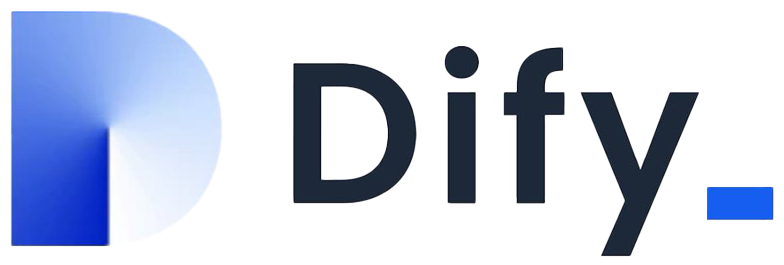
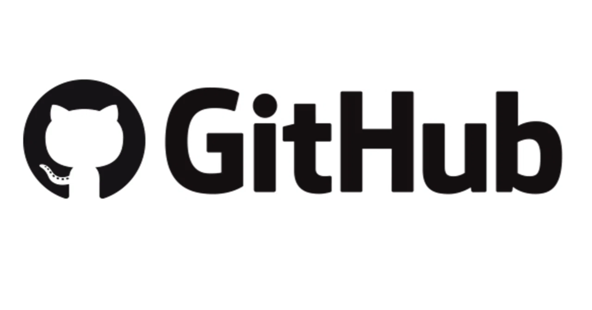

# 【Dify】公開中のアプリを自分のDify環境に！インストール手順を初心者向けに紹介

## はじめに
本リポジトリは、noteで公開中のマガジン「[Theater No.Dify](https://note.com/theater_no7/m/m3878d25bb9ff)」の中で作成・紹介したDifyのアプリを、どなたでもインストールできるように配布している場所です。

具体的なインストール手順や注意点は、このREADMEファイルをお読みください。

noteの記事同様、初心者の方でもわかりやすい文章を心がけますので、参考にしていただけると幸いです。

筆者同様、Difyで作成したアプリをGithubで公開している方はたくさんいらっしゃいます。  
基本的には同様の手順でインストールが可能かと思いますが、仕様が異なる場合もあるので、アプリの開発者の方の案内に従ってください。

## 【まずはここから】各用語の説明
エンジニア寄りの用語がいくつか登場するため、事前に用語を確認しておきましょう。

### Difyとは？

Difyは、**AIを活用したアプリケーションの開発や運用を簡単に行えるプラットフォーム**です。  
コードを書くのが苦手な人でも、直感的な操作でAIを活用したアプリを作ることができます。

例えば、チャットボットやデータ分析ツールなど、さまざまな用途に対応可能です。  
Difyを使えば、**効率よくAIの力を取り入れたサービスを作ることができる**ので、初心者にもおすすめです。

#### Difyにおけるyamlファイルとは？
Difyにおけるyamlファイルは、**設定や構成情報を記述するためのファイル形式**です。  
YAML（ヤムル）は、人間が読みやすい形式でデータを記述できるため、設定ファイルとしてよく使われます。

Difyでは、yamlファイルを使ってシステムの動作や設定を簡単に管理できます。  
例えば、アプリケーションの設定や環境変数、サービスの依存関係などをyamlファイルに記述しておくことで、開発者間での共有が容易になります。

YAMLの主な特徴は以下の通りです

- **構造化されたデータ**：インデントを使ってデータの階層構造を表現します。
- **シンプルな記法**：記号が少なく、直感的に理解しやすいです。
- **柔軟性**：リストやマップなど、さまざまなデータ型をサポートしています。

Githubで、Difyアプリを公開している方の多くはこのyamlファイルを配布しているはずです。  
基本的にはyamlファイルを自分のDify環境にインストールすればアプリを再現することができます。  
（アプリ内でLLMを使っている場合、そのAPIのインストールが必要な場合があります。）

### GitHubとは？

GitHubは、**Gitで管理しているファイルやプログラムを保存・共有するためのサービス**です。  
開発者同士が協力して作業できるよう、変更履歴を管理したり、意見を交換したりする機能があります。

たとえば、チームでアプリを作る場合、コードをGitHubにアップしておけば、全員が最新の状態を確認しながら作業できます。  
初心者からプロまで幅広く使われており、プログラミングを学ぶ人にも役立つツールです。
（筆者も非エンジニアですが、エンジニアの気持ちがわかるようになりたかったため、Gitを学び始めました。）

### そもそもGitとは？
Git（Git管理）とは、プログラムのコードやデータを効率的に管理するための**管理方法の名前**です。  
Gitというツールを使うことで、**作業の履歴を記録したり、複数人で同じプロジェクトに取り組むことが簡単になります**。

例えば、間違えてコードを変更してしまった場合でも、過去の状態に戻すことができます。  
チームでの作業でも、誰がどこを変更したかが一目でわかるので、スムーズな開発が可能です。

**Gitで管理したファイルやプログラムをアップロードする場所がGithub**という関係性です。

#### Git特有の言葉
Gitには、いくつかの専門用語があります。  
今回のDifyアプリのインストールでは、「リポジトリ」が分かれば十分ですが、Gitに興味のある方は少し調べてみることをお勧めします。

|用語|説明|
|-|-|
| **リポジトリ**|プロジェクトのファイルや履歴をまとめて保存する場所のことです。|
| **クローン**|リポジトリ（後述）を自分のPCにコピーすることです。これで作業を始められます。|
|**プル**|リポジトリの最新情報を自分のPCに取り込むことです。|
| **プッシュ**|自分の作業内容をリポジトリに反映させることです。|

これらの言葉を覚えれば、Gitを使った管理がぐっと身近になります！

## Githubに公開されているDifyアプリを自分の環境にインストールする方法
Githubで公開されているDifyアプリを自分の環境にインストールする方法を、以下の4ステップに分けてご説明します。

- STEP1 Dify環境を整える
- STEP2 Githubからyamlファイルをダウンロードする
- STEP3 自分のDify環境にyamlファイルをインポートする
- STEP4 必要なAPIなどをそろえ、動かしてみる

### STEP1 Dify環境を整える
### STEP2 Githubからyamlファイルをダウンロードする
### STEP3 自分のDify環境にyamlファイルをインポートする
### STEP4 必要なAPIなどをそろえ、動かしてみる